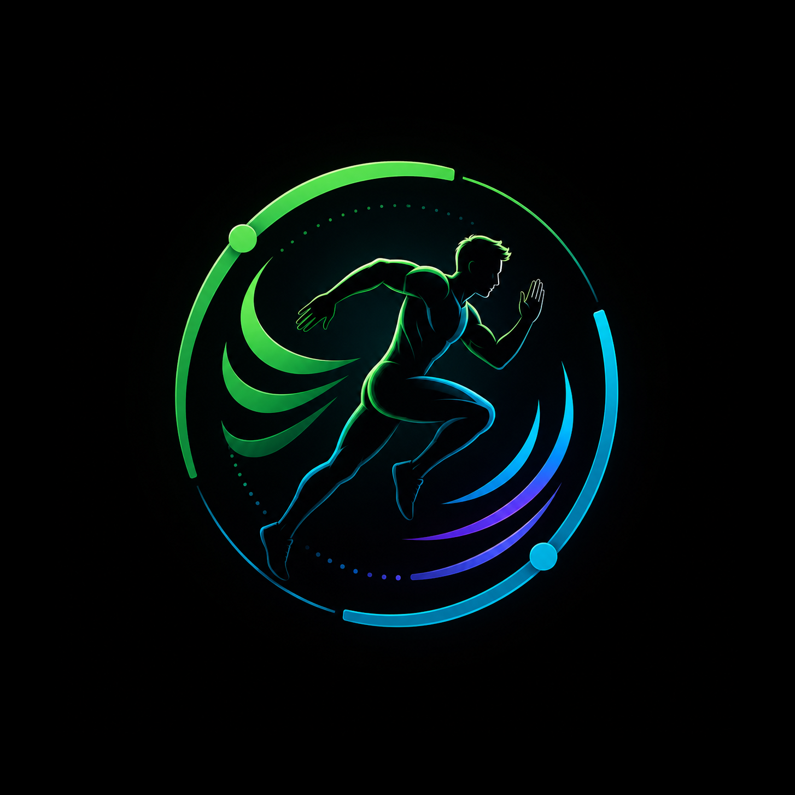

<p align="center">
  
</p>

<h1 align="center">AdaptFit</h1>

<p align="center">
  <strong>AI-Powered Adaptive Fitness & Lifestyle Agent</strong>
</p>

<p align="center">
  <a href="#features">Features</a> •
  <a href="#architecture">Architecture</a> •
  <a href="#tech-stack">Tech Stack</a> •
  <a href="#getting-started">Getting Started</a> •
  <a href="#project-structure">Project Structure</a> •
  <a href="#license">License</a>
</p>

<p align="center">
  
  
  
  
  
  
</p>

---

AdaptFit is a full-stack mobile application that combines **AI coaching**, **nutrition tracking**, **workout logging**, **step counting**, and **lifestyle analytics** into a single, cohesive fitness platform. It uses Google's Gemini AI as the backbone of its intelligent coaching system — called **Aether** — which provides personalized workout plans, meal plans, form analysis feedback, and daily insights based on your real activity data.

---

## Features

### Home Dashboard
- **Daily summary cards** — calories consumed, macros, workouts completed, and steps walked at a glance.
- **AI Coach Insights** — Aether generates a daily personalized insight card based on recent nutrition, workout, step, sleep, and hydration data.
- **Live step counter** — real-time pedometer integration via Android Health Connect and device sensors, with daily/weekly/monthly/yearly history charts.
- **Step goal management** — configurable daily step goals synced to Firestore.

### Aether — AI Coach
- **Conversational AI chat** powered by Google Gemini with full streaming (SSE) support.
- **Context-aware** — Aether reads your workout logs, nutrition entries, step history, sleep, hydration, and profile data to give grounded advice.
- **Workout plan generation** — structured workout plans with exercises, sets, and reps, rendered as interactive cards.
- **Meal plan generation** — full meal plans with per-meal macro and micronutrient breakdowns.
- **Voice input** — record audio messages that are transcribed by Gemini and sent as chat input.
- **Multi-conversation support** — create, switch between, and delete independent chat threads.
- **Tool use** — the coach can invoke backend tools to log workouts, meals, and more on your behalf.
- **Intelligence events** — every write (workout, meal, hydration, sleep, profile) publishes an event that feeds the coach's context engine.

### Nutrition Tracking
- **Food search** — search the USDA FoodData Central and Open Food Facts databases simultaneously, with results merged and ranked.
- **Barcode scanning** — scan product barcodes via the device camera to instantly look up nutritional information.
- **Plate food analysis** — photograph your plate and let Gemini Vision + Google Cloud Vision identify individual food items, estimate portions, and calculate per-item and total macros/micros.
- **Detailed logging** — log meals as breakfast, lunch, dinner, or snacks with full nutrient data: calories, protein, carbs, fat, fiber, sodium, potassium, calcium, iron, and vitamin C.
- **Daily nutrition history** — browse past days with a date picker and calendar view.
- **Manual entry** — add custom foods with manual nutrient input.

### Workout Tracking
- **Workout catalog search** — search a comprehensive exercise database with MET (Metabolic Equivalent of Task) values for accurate calorie estimation.
- **MET-based calorie calculation** — automatic calorie burn estimation using MET values, user body weight, and workout duration.
- **Workout form check** — record exercise movements, extract pose metrics on-device, and send them to Gemini for AI-powered form analysis and technique feedback.
- **Workout logging** — log workouts with exercise name, duration, calories, and optional notes.
- **Calendar view** — visualize workout history on a monthly calendar.

### Profile & Settings
- **User profile** — name, age, gender, height, weight, and fitness goals.
- **Profile editing** — update personal data with changes synced to Firestore and published as intelligence events.
- **Google Sign-In** — authenticate with Google via `@react-native-google-signin`.
- **Email + OTP Sign-Up** — custom email registration flow with server-side OTP verification via SMTP and branded emails.
- **Password setup** — post-registration password configuration for email-based accounts.

### Push Notifications
- **Expo push notifications** — server-side scheduled push notifications via a cron system.
- **Smart scheduling** — configurable daily send count (3–5) with minimum gap enforcement (180–240 min) to avoid notification fatigue.
- **Token registration** — automatic push token registration with timezone and device metadata.
- **Android notification channels** — dedicated "Daily progress" notification channel.

### Intelligence & Analytics
- **Event-driven architecture** — BullMQ job queues process intelligence events asynchronously.
- **Signal engine** — deterministic scoring modules compute user signal packets (trends, states, decisions) from raw data.
- **State machine classification** — XState-based coaching state machines for structured behavioral transitions.
- **Signal caching** — multi-tier caching with Redis + in-memory LRU for precomputed signal packets.
- **Prometheus metrics** — full observability with `/metrics` endpoint exposing request latency, cache hit rates, queue depths, and more.

---

## Architecture

```
┌─────────────────────────────────────────────────────────────┐
│                    React Native App (Expo)                  │
│  ┌──────┐ ┌─────────┐ ┌───────────┐ ┌───────┐ ┌─────────┐   │
│  │ Home │ │ Workout │ │ Nutrition │ │Aether │ │ Profile │   │
│  └──┬───┘ └────┬────┘ └─────┬─────┘ └───┬───┘ └────┬────┘   │
│     │          │            │            │          │       │
│     └──────────┴────────────┴────────────┴──────────┘       │
│                          │                                  │
│               services/ (API clients)                       │
│     ┌────────────────────┼───────────────────────┐          │
│     │  aiCoach.ts        │  nutritionApi.ts      │          │
│     │  formAnalysis.ts   │  workoutLog.ts        │          │
│     │  stepLog.ts        │  pushNotifications.ts │          │
│     └────────────────────┼───────────────────────┘          │
└──────────────────────────┼──────────────────────────────────┘
                           │ HTTP / SSE
┌──────────────────────────┼──────────────────────────────────┐
│               nutrition-proxy (Express.js)                  │
│                          │                                  │
│  ┌───────────────────────┼────────────────────────────┐     │
│  │  server.js  ─── Nutrition search, plate analysis   │     │
│  │  coach/     ─── AI chat, streaming, conversations  │     │
│  │  ai/        ─── Intent routing, prompt compression │     │
│  │  intelligence/ ── Signal engine, state machines    │     │
│  │  events/    ─── Event bus + BullMQ publishing      │     │
│  │  queues/    ─── BullMQ workers for async processing│     │
│  │  auth/      ─── Email OTP verification             │     │
│  │  formAnalysis/ ─ Workout form analysis             │     │
│  │  home/      ─── Home insights API                  │     │
│  │  notifications/ ── Push notification cron          │     │
│  │  observability/ ── Pino logger + Prometheus metrics│     │
│  │  schemas/   ─── Zod validation contracts           │     │
│  │  cache/     ─── Redis + in-memory LRU cache        │     │
│  └────────────────────────────────────────────────────┘     │
│                          │                                  │
│           ┌──────────────┼──────────────┐                   │
│           ▼              ▼              ▼                   │
│      Firebase       Redis/BullMQ    Google APIs             │
│   (Auth+Firestore)   (Cache+Queue)  (Gemini, Vision)        │
└─────────────────────────────────────────────────────────────┘
```

---

## Tech Stack

### Mobile App
| Technology | Purpose |
|---|---|
| **React Native 0.81** | Cross-platform mobile framework |
| **Expo SDK 54** | Managed workflow, OTA updates, EAS Build |
| **TypeScript 5.9** | Type-safe application code |
| **React Navigation 7** | Bottom tabs + native stack navigation |
| **Firebase Auth** | Google Sign-In + email/password authentication |
| **Cloud Firestore** | User data, logs, and conversation persistence |
| **Expo Camera** | Barcode scanning + plate food capture |
| **Expo Sensors** | Pedometer / step counter |
| **Expo Audio** | Voice recording for AI coach input |
| **Expo Notifications** | Push notification handling |
| **React Native Health Connect** | Android Health Connect step data integration |
| **Lucide React Native** | Icon library |
| **React Native Calendars** | Calendar view for workout history |

### Backend (nutrition-proxy)
| Technology | Purpose |
|---|---|
| **Node.js + Express** | REST API server |
| **Google Gemini AI** (`@google/genai`) | AI coaching, meal/workout plan generation, transcription, form analysis, plate food detection |
| **Google Cloud Vision** | Food image object detection and label detection |
| **Firebase Admin SDK** | Server-side auth verification + Firestore access |
| **Redis + ioredis** | Response caching, signal caching, session state |
| **BullMQ** | Job queue for async intelligence event processing |
| **XState** | State machine definitions for coaching behavior |
| **Zod** | Runtime schema validation for API I/O, events, and AI outputs |
| **Pino** | Structured JSON logging |
| **prom-client** | Prometheus-compatible metrics collection |
| **Nodemailer** | SMTP email delivery for OTP verification |
| **js-tiktoken** | Token counting for prompt budget management |

### External APIs
| API | Usage |
|---|---|
| **USDA FoodData Central** | Nutritional database search |
| **Open Food Facts** | Barcode lookups + food search (fallback) |
| **Google Gemini API** | LLM for coaching, vision, transcription |
| **Google Cloud Vision API** | Food object detection from plate images |
| **Expo Push Notification Service** | Server-to-device push delivery |

---

## Getting Started

### Prerequisites

- **Node.js** ≥ 18
- **npm** (comes with Node)
- **Expo CLI** — `npm install -g expo-cli` (or use `npx expo`)
- **Android Studio** (for Android builds) or **Expo Go** (for development)
- **Redis** (optional, for caching and BullMQ queues)
- **Firebase project** with Auth + Firestore enabled
- **Google Cloud project** with Gemini API and Cloud Vision API enabled

### 1. Clone the repository

```bash
git clone https://github.com/KrishTanna28/AdaptFit.git
cd AdaptFit
```

### 2. Set up the backend (nutrition-proxy)

```bash
cd adaptive-fitness-agent/nutrition-proxy
npm install
```

Create a `.env` file from the example:

```bash
cp .env.example .env
```

Fill in the required environment variables:

| Variable | Required | Description |
|---|---|---|
| `PORT` | No | Server port (default: `4000`) |
| `FIREBASE_PROJECT_ID` | Yes | Firebase project ID |
| `FIREBASE_CLIENT_EMAIL` | Yes | Firebase service account email |
| `FIREBASE_PRIVATE_KEY` | Yes | Firebase service account private key |
| `USDA_API_KEY` | Yes | [USDA FoodData Central API key](https://fdc.nal.usda.gov/api-key-signup) |
| `GOOGLE_VISION_PROJECT_ID` | No | Google Cloud project for Vision API |
| `GOOGLE_VISION_CLIENT_EMAIL` | Yes* | Vision API service account email |
| `GOOGLE_VISION_PRIVATE_KEY` | Yes* | Vision API service account key |
| `REDIS_URL` | No | Redis connection URL (e.g., `redis://127.0.0.1:6379`) |
| `AI_PROVIDER` | No | AI provider (`gemini` by default) |
| `SMTP_HOST`, `SMTP_PORT`, `SMTP_USER`, `SMTP_PASS` | No | SMTP config for email OTP signup |
| `EXPO_ACCESS_TOKEN` | No | Expo push notification access token |

> \* Required for plate food image analysis. Without these, plate scanning will be unavailable.

Start the backend:

```bash
npm run dev
```

#### Optional: Start Redis (WSL on Windows)

```bash
# In WSL:
sudo apt update
sudo apt install -y redis-server
sudo service redis-server start
redis-cli ping  # Should return PONG

# Back in PowerShell — verify connectivity:
Test-NetConnection -ComputerName 127.0.0.1 -Port 6379
```

### 3. Set up the mobile app

```bash
cd adaptive-fitness-agent
npm install
```

Create a `.env` file with your API base URLs:

```env
EXPO_PUBLIC_NUTRITION_API_BASE_URL=http://<YOUR_LAN_IP>:4000
EXPO_PUBLIC_COACH_API_BASE_URL=http://<YOUR_LAN_IP>:4000
```

> Replace `<YOUR_LAN_IP>` with your machine's local network IP address (e.g., `192.168.1.100`). `localhost` will not work from a physical device.

### 4. Configure Firebase

1. Place your `google-services.json` in the `adaptive-fitness-agent/` directory.
2. Ensure your Firebase project has **Authentication** (Google + Email/Password providers) and **Cloud Firestore** enabled.

### 5. Run the app

```bash
# Start Metro bundler
npx expo start

# Or run directly on Android
npx expo run:android
```

### 6. Build for distribution (EAS)

```bash
# Development build (internal)
eas build --profile development --platform android

# Preview APK
eas build --profile preview --platform android

# Production build
eas build --profile production --platform android
```

---

## Project Structure

```
AdaptFit/
├── README.md
├── LICENSE                          # MIT License
├── Redis-start                      # Redis setup instructions
│
└── adaptive-fitness-agent/          # Main application
    ├── App.tsx                      # Root component (NavigationContainer + AuthGate)
    ├── index.ts                     # Expo entry point
    ├── app.json                     # Expo configuration
    ├── eas.json                     # EAS Build profiles
    ├── package.json                 # App dependencies
    ├── tsconfig.json                # TypeScript config
    ├── met.json                     # MET values dataset for calorie estimation
    │
    ├── app/                         # Screens & navigation
    │   ├── AuthGate.tsx             # Auth state router (Login → PasswordSetup → Home)
    │   ├── HomeTabs.tsx             # Bottom tab navigator (5 tabs)
    │   ├── HomeScreen.tsx           # Dashboard with daily summary + AI insights
    │   ├── WorkoutScreen.tsx        # Workout logging + calendar history
    │   ├── NutritionScreen.tsx      # Nutrition tracking + daily meal log
    │   ├── AICoachScreen.tsx        # Aether AI chat with streaming
    │   ├── ProfileScreen.tsx        # User profile + settings
    │   ├── LoginScreen.tsx          # Google Sign-In + email OTP login
    │   ├── PasswordSetupScreen.tsx  # Post-signup password configuration
    │   ├── WorkoutSearchModal.tsx   # Exercise catalog search
    │   ├── WorkoutFormCheckModal.tsx # Camera-based form analysis
    │   ├── NutritionScreenModal.tsx # Food search + logging modal
    │   ├── PlateFoodCaptureModal.tsx # Plate photo capture
    │   ├── BarcodeFoodScannerModal.tsx # Barcode scanner
    │   ├── StepsHistoryModal.tsx    # Step history charts
    │   ├── ProfileEditModal.tsx     # Profile editing form
    │   ├── DatePickerModal.tsx      # Date navigation
    │   ├── PoseCamera.tsx           # Camera feed for pose detection
    │   └── *.styles.ts              # Co-located StyleSheet modules
    │
    ├── components/                  # Reusable UI components
    │   ├── AuthForm.tsx             # Email/password auth form
    │   └── ui/
    │       ├── AppAlert.tsx         # Global alert/toast system
    │       ├── AppButton.tsx        # Themed button component
    │       ├── AppCard.tsx          # Card container
    │       ├── AppTextField.tsx     # Text input with label
    │       ├── AppSkeleton.tsx      # Loading skeleton
    │       └── LogoSplash.tsx       # Splash screen logo
    │
    ├── hooks/                       # Custom React hooks
    │   ├── useAuthUser.ts           # Firebase auth state listener
    │   └── useLiveStepCounter.ts    # Real-time pedometer + Health Connect
    │
    ├── services/                    # API clients & data layer
    │   ├── firebase.ts              # Firebase app initialization
    │   ├── googleSignin.ts          # Google Sign-In configuration
    │   ├── aiCoach.ts               # Aether coach API (chat, stream, transcribe)
    │   ├── nutritionApi.ts          # Food search, barcode, plate analysis
    │   ├── formAnalysis.ts          # Workout form analysis API
    │   ├── nutritionLog.ts          # Firestore nutrition log CRUD
    │   ├── workoutLog.ts            # Firestore workout log CRUD
    │   ├── lifestyleLog.ts          # Sleep, hydration, recovery logging
    │   ├── stepLog.ts               # Daily step log persistence
    │   ├── stepHistory.ts           # Step history with aggregation
    │   ├── aggregatedStepLog.ts     # Weekly/monthly/yearly step aggregation
    │   ├── pushNotifications.ts     # Expo push token registration
    │   ├── intelligenceEvents.ts    # Intelligence event publisher
    │   ├── homeCacheApi.ts          # Home screen data caching
    │   ├── workoutCalories.ts       # MET-based calorie calculations
    │   ├── workoutCatalogSearch.ts  # Exercise database search
    │   ├── workoutMetDataset.ts     # MET dataset loader
    │   ├── workoutMetMapping.ts     # Exercise → MET value mapping
    │   ├── workoutMetResolver.ts    # MET resolution logic
    │   ├── poseMetrics.ts           # On-device pose metric extraction
    │   ├── signupVerification.ts    # Email OTP verification client
    │   └── helperFunctions.ts       # Shared utility functions
    │
    ├── theme/                       # Design system
    │   ├── designSystem.ts          # Colors, typography, spacing, radii, shadows
    │   └── globalStyles.ts          # Global style presets
    │
    ├── utils/                       # Utilities
    │   └── authRouting.ts           # Auth state routing logic
    │
    ├── assets/                      # Static assets
    │   ├── logo.png                 # App icon & splash image
    │   └── logo svg.png             # SVG variant of logo
    │
    ├── scripts/                     # Build scripts
    │   └── patch-rn-gradle.js       # React Native Gradle compatibility patch
    │
    └── nutrition-proxy/             # Backend server
        ├── package.json             # Backend dependencies
        ├── .env.example             # Environment variable template
        ├── app.json                 # Proxy config
        │
        ├── docs/
        │   └── ai-orchestration-roadmap.md  # Architecture evolution plan
        │
        └── src/
            ├── server.js            # Express entry — nutrition search, plate analysis, Vision
            ├── redisCache.js        # Redis cache wrapper
            │
            ├── coach/               # AI Coach module
            │   ├── routes.js        # Chat, stream, conversations, home-insights, transcribe
            │   ├── geminiClient.js  # Gemini API client (chat + vision)
            │   ├── conversationStore.js  # Firestore conversation persistence
            │   ├── toolRouter.js    # Coach tool execution (log meals, workouts, etc.)
            │   ├── critic.js        # Response quality validation
            │   └── firebaseAdmin.js # Firebase Admin SDK initialization
            │
            ├── ai/                  # AI orchestration layer
            │   ├── compression/     # Token budgeting & prompt compression
            │   ├── prompts/         # System prompt templates
            │   ├── providers/       # AI provider abstraction
            │   ├── retrieval/       # Intent-aware context retrieval
            │   └── routing/         # Intent classification & routing
            │
            ├── intelligence/        # Deterministic intelligence engine
            │   ├── signalEngine.js  # Signal packet computation
            │   ├── signalStore.js   # Signal state persistence
            │   ├── stateMachines/   # XState coaching state definitions
            │   └── validators/      # Safety & guardrail validators
            │
            ├── events/              # Event-driven system
            │   ├── eventBus.js      # In-process event emitter
            │   ├── handlers.js      # Event handler registration
            │   └── routes.js        # Event publishing API
            │
            ├── queues/              # Async job processing
            │   ├── connection.js    # BullMQ Redis connection
            │   ├── intelligenceQueue.js  # Intelligence event queue
            │   └── worker.js        # Queue worker (signal recomputation)
            │
            ├── auth/                # Authentication
            │   └── emailOtp.js      # Email OTP generation, verification, SMTP delivery
            │
            ├── formAnalysis/        # Workout form analysis
            │   ├── routes.js        # Form analysis API endpoint
            │   └── prompt.js        # Gemini prompt for form feedback
            │
            ├── home/                # Home screen backend
            │   └── routes.js        # Home insights + dashboard data API
            │
            ├── notifications/       # Push notifications
            │   └── routes.js        # Token registration + cron-based send scheduler
            │
            ├── observability/       # Monitoring & logging
            │   ├── logger.js        # Pino structured logger
            │   └── metrics.js       # Prometheus metrics (prom-client)
            │
            ├── schemas/             # Zod validation schemas
            │   ├── api.js           # API request/response schemas
            │   ├── aiOutputs.js     # LLM output validation
            │   ├── events.js        # Intelligence event schemas
            │   ├── firestore.js     # Firestore document schemas
            │   ├── signals.js       # Signal packet schemas
            │   ├── primitives.js    # Shared primitives
            │   ├── validators.js    # Validation utilities
            │   ├── types.d.ts       # TypeScript type declarations
            │   └── index.js         # Schema exports
            │
            └── cache/               # Caching layer
                ├── cacheManager.js  # Multi-tier cache orchestration
                └── memoryCache.js   # In-memory LRU cache
```

---

## Environment Variables

### Mobile App (`.env`)

| Variable | Description |
|---|---|
| `EXPO_PUBLIC_NUTRITION_API_BASE_URL` | Base URL of the nutrition-proxy server |
| `EXPO_PUBLIC_COACH_API_BASE_URL` | Base URL for coach API (defaults to nutrition proxy) |

### Backend (`nutrition-proxy/.env`)

See [`nutrition-proxy/.env.example`](adaptive-fitness-agent/nutrition-proxy/.env.example) for the full list with descriptions.

---

## API Endpoints

| Method | Endpoint | Description |
|---|---|---|
| `GET` | `/api/foods/search` | Search food databases (USDA + Open Food Facts) |
| `GET` | `/api/foods/barcode/:code` | Look up food by barcode |
| `POST` | `/api/foods/plate/analyze` | Analyze plate food image (Vision + Gemini) |
| `POST` | `/api/coach/chat` | Send a message to Aether (JSON response) |
| `POST` | `/api/coach/chat/stream` | Send a message to Aether (SSE streaming) |
| `GET` | `/api/coach/conversations` | List coach conversations |
| `GET` | `/api/coach/conversations/:id/messages` | Get conversation messages |
| `DELETE` | `/api/coach/conversations/:id` | Delete a conversation |
| `GET` | `/api/coach/home-insights` | Get AI-generated daily insight |
| `POST` | `/api/coach/transcribe` | Transcribe audio to text |
| `POST` | `/api/form-analysis/analyze` | Analyze workout form from pose metrics |
| `POST` | `/api/events` | Publish an intelligence event |
| `POST` | `/api/notifications/register-token` | Register Expo push token |
| `GET` | `/metrics` | Prometheus metrics |

---

## Design System

AdaptFit uses a custom dark-mode design system defined in [`theme/designSystem.ts`](adaptive-fitness-agent/theme/designSystem.ts):

- **Primary**: `#22C55E` (vibrant green)
- **Background**: `#050505` (near-black)
- **Cards**: `#111111` / `#171717`
- **Accent colors**: Cyan (`#06B6D4`), Blue (`#38BDF8`), Purple (`#8B5CF6`)
- **Macro colors**: Protein (blue), Carbs (purple), Fat (red)
- **Typography scale**: Metric → Heading Large → Heading Medium → Body → Caption → Label
- **Spacing scale**: `xs(4)` → `sm(8)` → `md(12)` → `lg(16)` → `xl(20)` → `xxl(28)`
- **Border radii**: `xs(6)` → `sm(10)` → `md(16)` → `lg(20)` → `xl(28)` → `pill(999)`

---

## License

This project is licensed under the **MIT License** — see the [LICENSE](LICENSE) file for details.

Copyright © 2026 [Krish Tanna](https://github.com/KrishTanna28)
